# MPLS_L3VPN
Comparto un escenario de laboratorio enfocado en redes de proveedor (Service Provider), implementando MPLS L3VPN para ofrecer conectividad aislada entre múltiples clientes, integrando además servicios reales como DNS, HTTP y VoIP.
## Topología del Laboratorio
🏗 Tecnologías Implementadas

🏷MPLS L3VPN

🔁 IS-IS como IGP en el Core

📡 MP-BGP (VPNv4) en los Routers PE

🧭 VRFs por Cliente (A y B)

🏢 Arquitectura Multi-Sitio

🧩 Entorno Multi-Vendor  (Cisco, Juniper, Huawei, Fortinet, MikroTik, Palo Alto, VyOS)

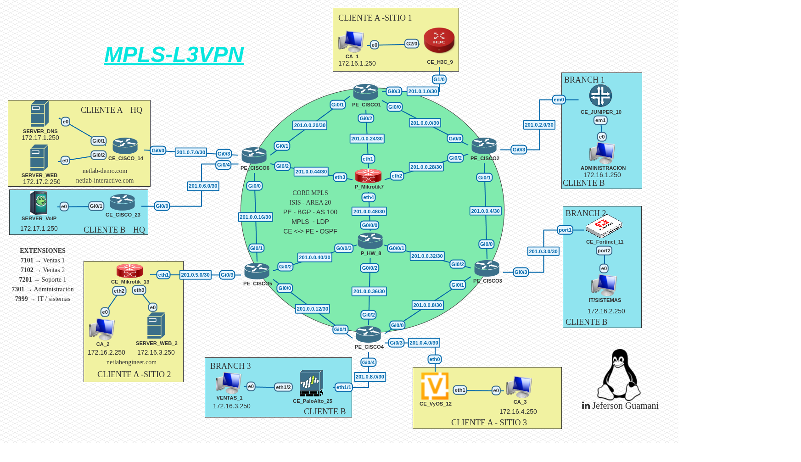

En MPLS L3VPN no basta con hacer ping — se tiene que validar 3 planos:

- [x] Enrutamiento del cliente (VRF)
- [x] MP-BGP (VPNv4)
- [x] MPLS (Etiquetas en el core)

## Tablas de Enrutamiento VRF Cliente A y Cliente B

✔ Ver rutas del cliente A y cliente B
✔ Si no hay rutas → problema en routing (CE-PE)

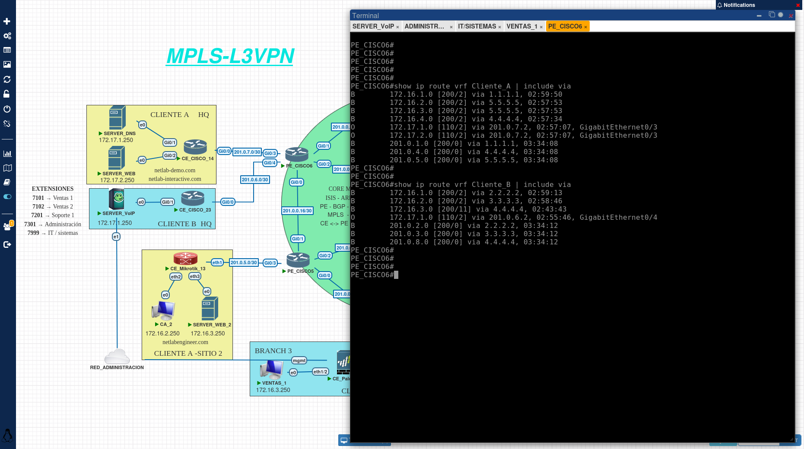

## Verificación MP-BGP 

La comprobación de la vecindad con los diferentes PE se realiza en el PE_CISCO6 debido a que el forma parte del cliente A y B a la vez por lo cual debería mostrar que se encuentra establecida las sesiones con las diferentes loopbacks de los otros PEs.

✔ Vecindad entre PEs en estado Establecido
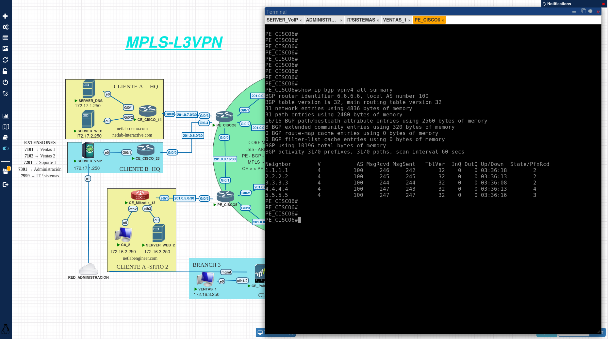

## Visualización de las Rutas

Se visualiza la tabla BGP correspondiente a las VPNv4 dentro de la infraestructura MPLS-L3VPN. Se identifican múltiples *Route Distinguisher (RD)* asociados a diferentes clientes o VRF, lo que permite diferenciar prefijos que pueden repetirse entre distintas redes. Asimismo, se muestran las rutas aprendidas junto con su *next hop*, métricas y atributos BGP, destacando aquellas marcadas como válidas y mejores rutas. También se aprecia la presencia de rutas pertenecientes a distintos segmentos (como 172.16.x.x y redes 201.0.x.x), evidenciando el intercambio de información entre sedes (HQ y branches) a través del core MPLS. Esta salida permite verificar el correcto funcionamiento del enrutamiento VPN y la propagación de rutas entre los distintos clientes.

✔ Si no se ve rutas → no hay L3VPN real 
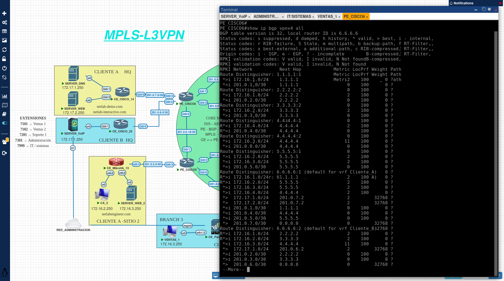

## Estado General MPLS
Se verifica las adyacencias establecidas mediante el protocolo LDP (Label Distribution Protocol) dentro del núcleo MPLS. En la salida se identifican los routers vecinos con los que se han formado sesiones LDP, incluyendo sus direcciones IP, identificadores LDP (LDP ID) y el estado de la conexión. Asimismo, se puede observar el tiempo de actividad de cada sesión y los parámetros de comunicación, lo que permite validar que el intercambio de etiquetas se está realizando correctamente. Esta información es fundamental para confirmar la correcta operación del plano de control MPLS y asegurar que la conmutación de etiquetas entre los routers del core se encuentra funcionando de manera adecuada.

✔ Se debe poder observar vecinos LDP activos
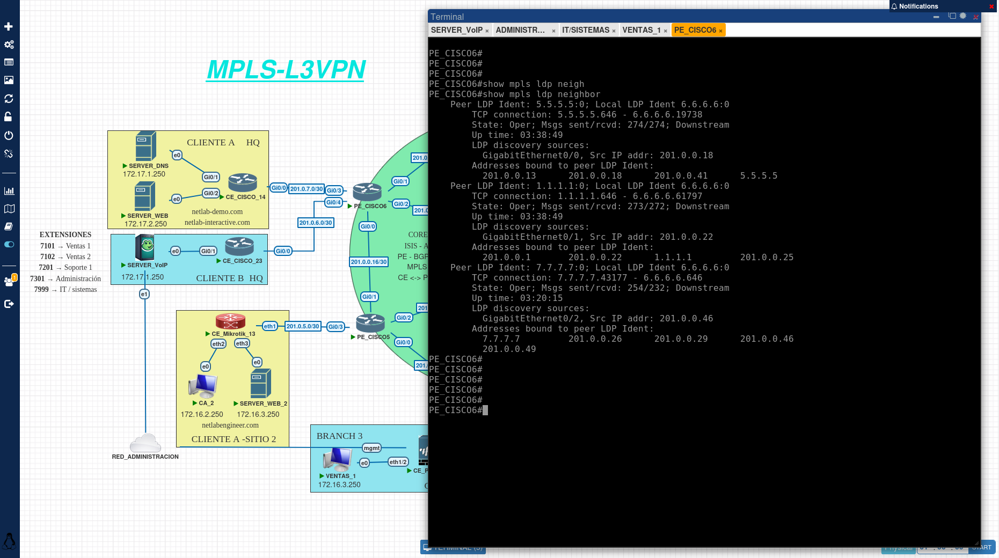

## Tabla de forwarding MPLS
Es importante observar la tabla de conmutación de etiquetas MPLS del router. En esta tabla se muestran las etiquetas locales asignadas, las etiquetas de salida, las interfaces asociadas y las direcciones IP de siguiente salto. Esta información permite comprender cómo el dispositivo realiza el reenvío de paquetes basándose en etiquetas en lugar de direcciones IP, identificando operaciones como swap, pop o push de etiquetas. Asimismo, se puede verificar que las rutas MPLS están correctamente programadas en el plano de datos, lo que garantiza un encaminamiento eficiente dentro del core MPLS y la correcta entrega del tráfico entre las distintas VPN.
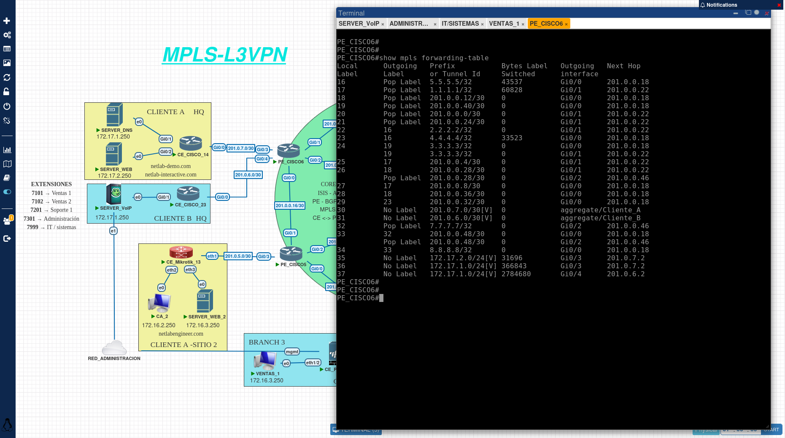

## Implementación de Servidores y Resolución de Consultas DNS

El servidor DNS está alojado sobre un sistema operativo Debian. Los distintos servicios del sistema son gestionados mediante un script centralizado que facilita su inicialización y administración.
Este script permite poner en funcionamiento, de manera eficiente, servicios como el servidor DHCP, el servidor HTTP y el propio servidor DNS, optimizando así la gestión y despliegue de la infraestructura.
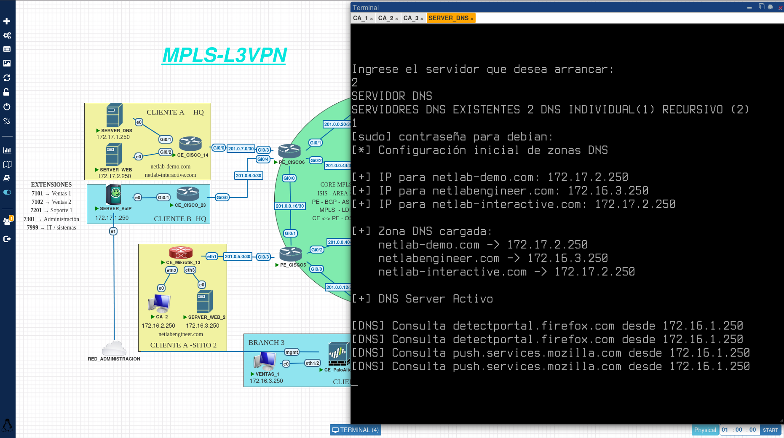

El servidor DNS posee la capacidad que el administrador observe las consultas realizadas, en este caso se mostró un dns no recursivo con el objetivo que las consultas se realicen únicamente a este servidor, sin embargo un dns recursivo brinda múltiples beneficios que en próximos laboratorios presentare.  
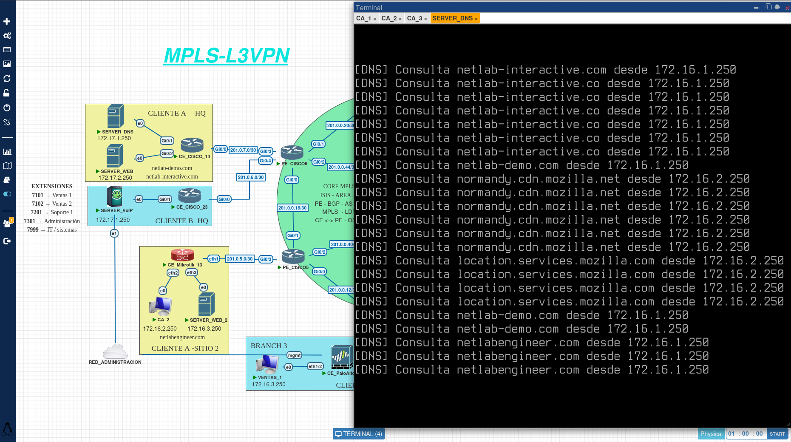

## Test de Conectividad Cede Central y Sucursales Cliente A

Mediante un script se realiza la prueba de conectividad desde una de las sucursales hacia la sede central y las otras sucursales, ademas de comprobar la resolución de dns de las correspondientes paginas web creadas.
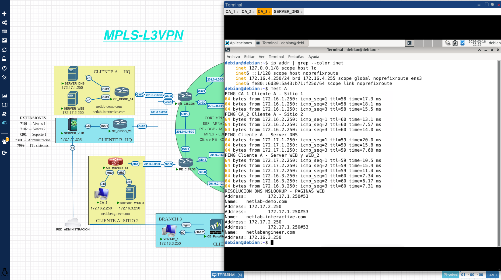

## Acceso a las Paginas Web 
Desde la sucursal 1 del Cliente A se accede a las diferentes paginas web alojadas en las diferentes sucursales y servidores web, comprobando de esta manera que el trafico http es transportado correctamente a través del core mpls. 
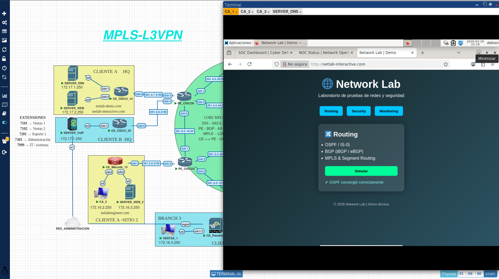
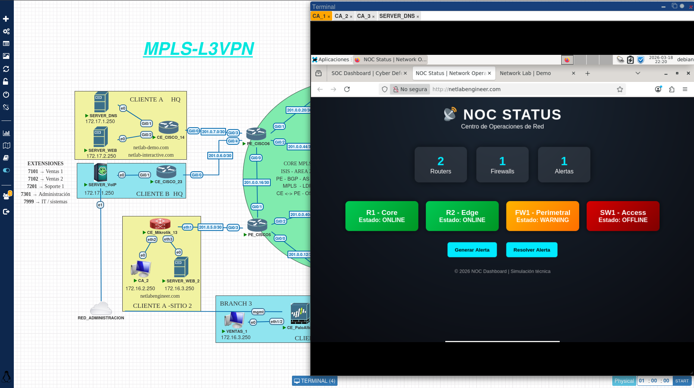
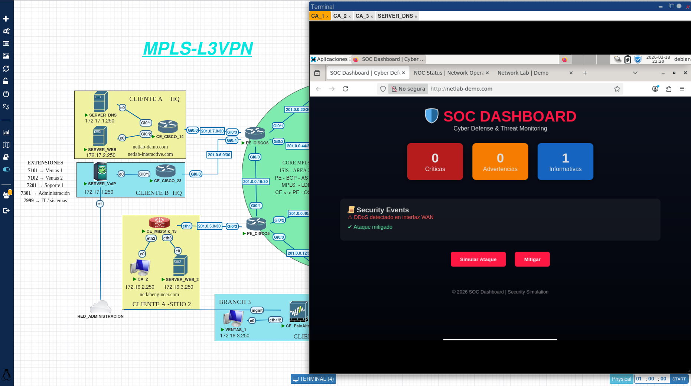

## Captura del Trafico Cliente A PE_CISCO_1 Interfaz G0/1
Mediante  Wireshark se captura el trafico entrante y saliente del puerto G0/1 del equipo Cisco PE_CISCO_1 en el cual se puede observar el trafico http y su encapsulacion y etiquetas correspondientes de MPLS
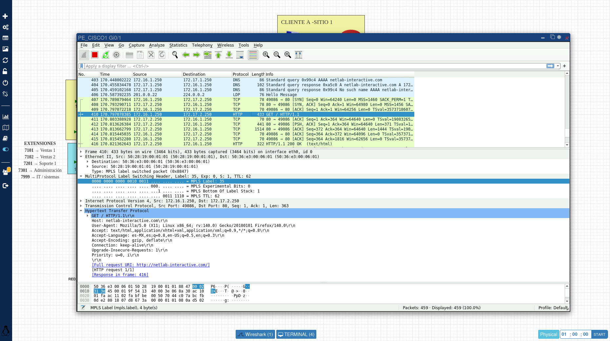

## Test de Conectividad Cede Central y Sucursales Cliente B

A diferencia del Cliente A, en el cliente B las pruebas de funcionamiento se realiza directamente en las sucursales al iniciar el Cliente VoIP Zoiper y enlazarlo al servidor VoIP el cual corre FreePBX siendo este un servidor de código abierto. Las siguientes capturas corroboran el correcto funcionamiento del servidor al conectar los correspondientes clientes con sus credenciales y realizando llamadas entre si.

Nota: Al implementar el servidor VoIP tomar en cuenta el firewall de el mismo debido a que desde el momento de su activación el servidor da 5 minutos antes de la activación del firewall con el objetivo de analizar y configurar el apartado de firewall cuya configuración debe poseer la ip desde la cual  se esta administrando el servidor, ademas se debe observar si alguna IP no se encuentra bloqueada lo cual impedirá que algún cliente con esa IP se conecte al servidor.

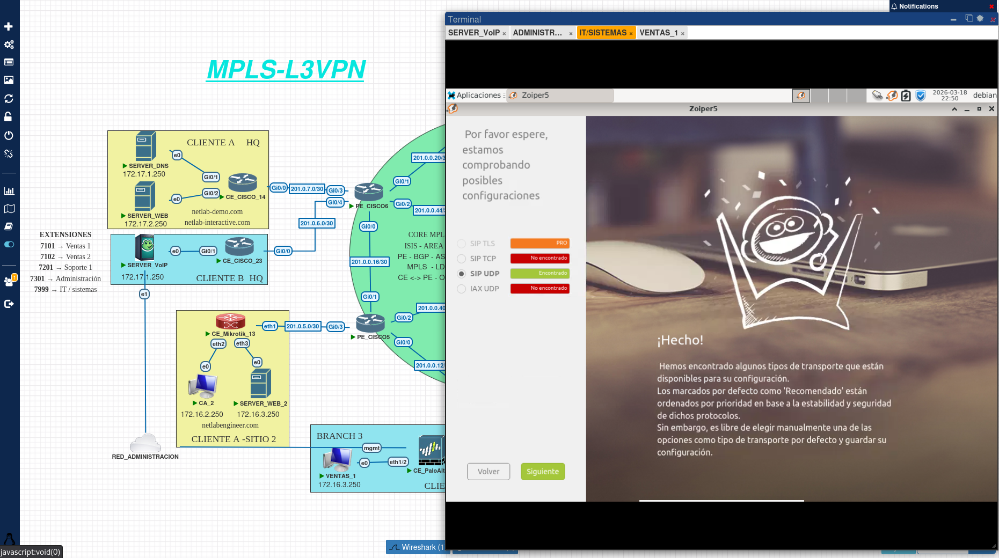
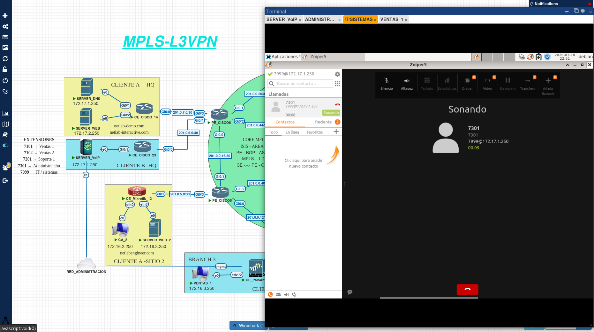

## Captura del Trafico Cliente B PE_CISCO_3 Interfaz G0/1
Mediante  Wireshark se captura el trafico entrante y saliente del puerto G0/1 del equipo Cisco PE_CISCO_3 en el cual se puede observar el trafico (RTP, SIP) y su encapsulacion y etiquetas correspondientes de MPLS
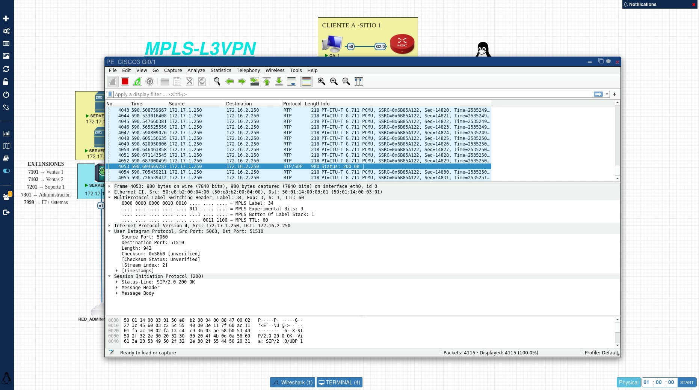

